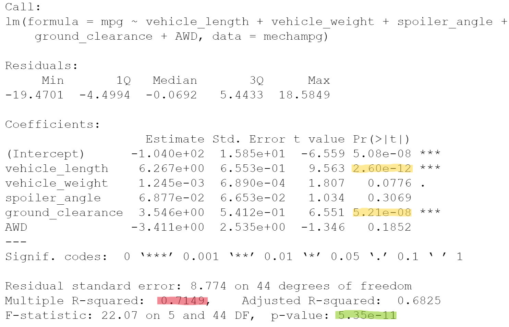

# MechaCar_Statistical_Analysis
Utilize R to assist automotive manufacturing 

## Purpose

The purpose of this project is to utilize R in reviewing automotive production data to provide insights which may help the MechaCar manufacturing team.  R is used to perform multiple linear regression analysis
to identify which variables predict mpg, provide summary statistics on production data, and to run t-tests to determine if manufacturing lots are consistent with the population.  Additionally, a statistical study
design on an approach for comparing performance of MechaCar vehicles against competitors is provided.

## Linear Regression to Predict MPG

Which variables/coefficients provided a non-random amount of variance to the mpg values in the dataset?
Is the slope of the linear model considered to be zero? Why or why not?
Does this linear model predict mpg of MechaCar prototypes effectively? Why or why not?

## Summary Statistics on Suspension Coils

The design specifications for the MechaCar suspension coils dictate that the variance of the 
suspension coils must not exceed 100 pounds per square inch.  Does the current manufacturing data 
meet this design specification for all manufacturing lots in total and each lot individually? Why or why not?

## T-Tests on Suspension Coils

## Study Design: MechaCar vs Competition

statistical study that can quantify how the MechaCar performs against the competition.  What metrics would be
 of interest to a consumer: for a few examples, cost, city or highway fuel efficiency, horse power, maintenance cost, or safety rating.

address the following questions:
What are the metrics to test
What is the null hypothesis or alternative hypothesis?
What statistical test would you use to test the hypothesis? And why?
What data is needed to run the statistical test?